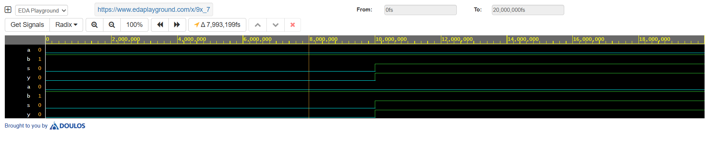
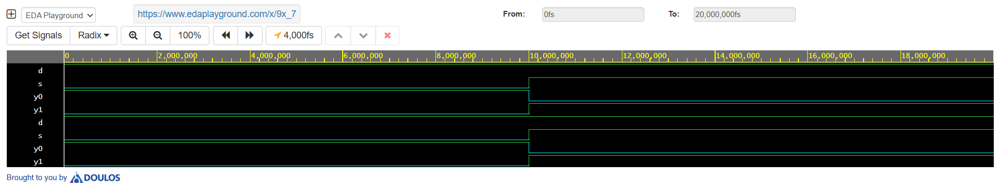

# MUX and DEMUX Design in VHDL

This project implements a 2:1 Multiplexer (MUX) and a 1:2 Demultiplexer (DEMUX) using VHDL.

## Features

* 2:1 Multiplexer design
* 1:2 Demultiplexer design
* Data selection and routing
* Simulation using VHDL

## Tools Used

* VHDL
* EDA Playground / ModelSim

## Description

The multiplexer selects one of the input signals based on the select line, while the demultiplexer routes the input signal to one of the outputs. The designs were verified through simulation.

## Simulation Waveform

## Author

Manoj U K
