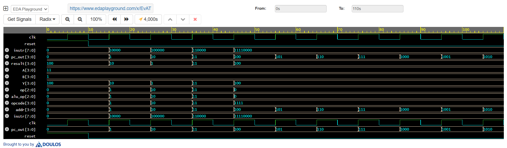

# 4-bit RISC Processor Design in Verilog

## 📌 Overview

This project implements a basic 4-bit Reduced Instruction Set Computer (RISC) processor using Verilog. The processor is capable of executing simple arithmetic and logical operations through a minimal instruction set.

## 🎯 Objective

To design and simulate a simple 4-bit CPU architecture including ALU, control unit, program counter, and instruction memory, demonstrating the working of a basic processor.

## ⚙️ Features

* 4-bit ALU for arithmetic and logic operations (ADD, SUB, AND, OR)
* Program Counter (PC) for sequential instruction execution
* Instruction Memory for storing operations
* Control Unit for decoding instructions
* Simulation of instruction execution using EDA Playground

## 🧩 Modules Used

* `alu.v` – Performs arithmetic and logical operations
* `pc.v` – Generates instruction addresses
* `instr_mem.v` – Stores instructions
* `control_unit.v` – Decodes opcode
* `risc_cpu.v` – Top module integrating all components
* `risc_tb.v` – Testbench for simulation

## 🛠️ Tools Used

* Verilog HDL
* EDA Playground (Simulation)
* EPWave (Waveform Viewer)

## 📊 Simulation Waveform

The waveform shows:

* Clock signal operation
* Program counter incrementing
* Instruction execution sequence
* ALU output changing based on operations

## ▶️ How to Run

1. Open EDA Playground
2. Paste all design modules in the design section
3. Paste testbench in the testbench section
4. Select **Icarus Verilog** as simulator
5. Click **Run** and view waveform

## 📈 Result

The processor successfully executes instructions sequentially, demonstrating correct operation of ALU and control logic.

## 👨‍💻 Author

Manoj U K
